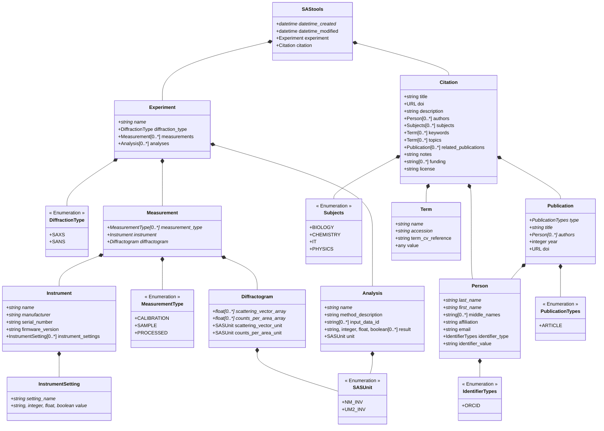

```mermaid
classDiagram
    SAStools *-- Experiment
    SAStools *-- Citation
    Experiment *-- DiffractionType
    Experiment *-- Measurement
    Experiment *-- Analysis
    Measurement *-- MeasurementType
    Measurement *-- Instrument
    Measurement *-- Diffractogram
    Instrument *-- InstrumentSetting
    Diffractogram *-- SASUnit
    Analysis *-- SASUnit
    Citation *-- Subjects
    Citation *-- Person
    Citation *-- Publication
    Citation *-- Term
    Person *-- IdentifierTypes
    Publication *-- PublicationTypes
    Publication *-- Person
    
    class SAStools {
        +datetime datetime_created*
        +datetime datetime_modified
        +Experiment experiment
        +Citation citation
    }
    
    class Experiment {
        +string name*
        +DiffractionType diffraction_type
        +Measurement[0..*] measurements
        +Analysis[0..*] analyses
    }
    
    class Measurement {
        +MeasurementType[0..*] measurement_type*
        +Instrument instrument*
        +Diffractogram diffractogram*
    }
    
    class Instrument {
        +string name*
        +string manufacturer*
        +string serial_number
        +string firmware_version
        +InstrumentSetting[0..*] instrument_settings
    }
    
    class InstrumentSetting {
        +string setting_name*
        +string, integer, float, boolean value*
    }
    
    class Diffractogram {
        +float[0..*] scattering_vector_array*
        +float[0..*] counts_per_area_array*
        +SASUnit scattering_vector_unit
        +SASUnit counts_per_area_unit
    }
    
    class Analysis {
        +string name*
        +string method_description
        +string[0..*] input_data_id
        +string, integer, float, boolean[0..*] result
        +SASUnit unit
    }
    
    class Citation {
        +string title
        +URL doi
        +string description
        +Person[0..*] authors
        +Subjects[0..*] subjects
        +Term[0..*] keywords
        +Term[0..*] topics
        +Publication[0..*] related_publications
        +string notes
        +string[0..*] funding
        +string license
    }
    
    class Person {
        +string last_name*
        +string first_name*
        +string[0..*] middle_names
        +string affiliation
        +string email
        +IdentifierTypes identifier_type
        +string identifier_value
    }
    
    class Publication {
        +PublicationTypes type*
        +string title*
        +Person[0..*] authors*
        +integer year
        +URL doi
    }
    
    class Term {
        +string name*
        +string accession*
        +string term_cv_reference
        +any value
    }
    
    class Subjects {
        << Enumeration >>
        +BIOLOGY
        +CHEMISTRY
        +IT
        +PHYSICS
    }
    
    class PublicationTypes {
        << Enumeration >>
        +ARTICLE
    }
    
    class IdentifierTypes {
        << Enumeration >>
        +ORCID
    }
    
    class DiffractionType {
        << Enumeration >>
        +SAXS
        +SANS
    }
    
    class MeasurementType {
        << Enumeration >>
        +CALIBRATION
        +SAMPLE
        +PROCESSED
    }
    
    class SASUnit {
        << Enumeration >>
        +NM_INV
        +UM2_INV
    }
    
```